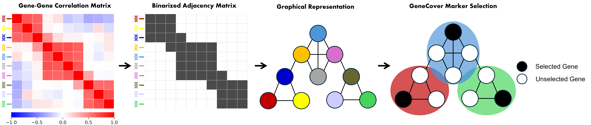

# GeneCover

GeneCover is a computational tool designed for scRNA-seq and spatial transcriptomics data to select pre-labeling marker genes based on gene-gene correlations.




## 🔗 Documentation

📘 Full documentation is available here:  
👉 [GeneCover Docs](https://your-docs-url.com)

The documentation includes:
- Installation Guide
- Basic Usage of GeneCover
- Tutorial on DLPFC Datasets
- Function References
- Citation Information
- Contact Details

## 📖 Citation

If you use GeneCover, please cite:

> Wang, A., Hicks, S., Geman, D., & Younes, L. (2025, April).  
> *GeneCover: A Combinatorial Approach for Label-free Marker Gene Selection*.  
> In International Conference on Research in Computational Molecular Biology (pp. 354–357). Cham: Springer Nature Switzerland.  
> DOI: [10.1101/2024.10.30.621151](https://doi.org/10.1101/2024.10.30.621151)

```bibtex
@inproceedings{wang2025genecover,
  title={GeneCover: A Combinatorial Approach for Label-free Marker Gene Selection},
  author={Wang, An and Hicks, Stephanie and Geman, Donald and Younes, Laurent},
  booktitle={International Conference on Research in Computational Molecular Biology},
  pages={354--357},
  year={2025},
  publisher={Springer Nature Switzerland}
}


### Installation
To install GeneCover, run:
`pip install git+https://github.com/ANWANGJHU/GeneCover.git
`

**Note: We strongly recommend installing the package in a virtual environment to avoid dependency conflicts.**

### Dependency: Gurobi
GeneCover requires Gurobi as a dependency for optimization. To install Gurobi in python, please follow [Gurobi Installation Guide](https://support.gurobi.com/hc/en-us/articles/360044290292-How-do-I-install-Gurobi-for-Python). Gurobi requires a license to use the interface. For information on how to obtain a license, please refer to  [this Gurobi support article](https://support.gurobi.com/hc/en-us/articles/12684663118993-How-do-I-obtain-a-Gurobi-license).

### Tutorial 
This tutorial provides a simple example of how to run GeneCover on your data. Note: GeneCover support input datasets from multiple samples / batches.

```python 
from genecover import *
import numpy as np
"""
User Input: 
data - an array of size N * d that store the log-normalized count expression data, where N is the number of cells and d is the number of genes.
Note: data can also be a list of numpy arrays with the same number of genes d, and the pipeline for generating marker panel is the same as using one dataset.

w - an array of size d that records cost of each gene. Users can simply set w = np.ones(data.shape[1]).
"""

# Compute the gene-gene correlation matrix
corr_mat = gene_gene_correlation(data)

# Obtain 100 GeneCover markers
markers = GeneCover(num_marker = 100, corr_mat = corr_mat, w = w, m = 3, lambdaMax = .3, lambdaMin = 0.05)

# Obtain 300 GeneCover markers through iterative selection with three iterations
iterative_markers = Iterative_GeneCover(incremental_sizes = [100, 100, 100], corr_mat = corr_mat, w = w, m = 3, lambdaMax = .3, lambdaMin = 0.05)
```