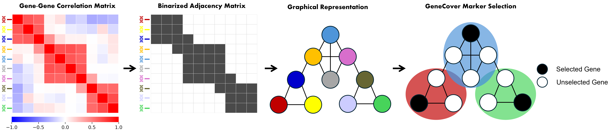

.. GeneCover Documentation documentation master file, created by
   sphinx-quickstart on Sat Jun 14 17:17:24 2025.
   You can adapt this file completely to your liking, but it should at least
   contain the root `toctree` directive.

GeneCover
=====================================

Wellcome to the documentation for **GeneCover**! GeneCover is a combinatorial method for label-free marker gene selection based on gene-gene correlation. 
It uses the minimal weight set cover to select a set of minimally redundant marker genes that characterizes the diverse correlation structures within the transcriptome.

------------

.. toctree::
   :maxdepth: 2
   :caption: Contents:

   Installation
   basic-usage
   functions
   cite-our-work
   contact
   